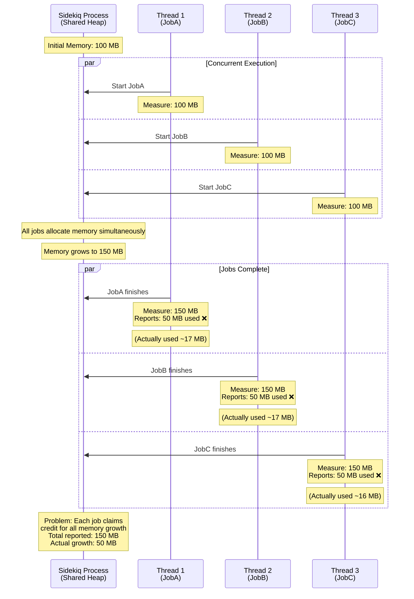

# Sidekiq Memory Logger

A Sidekiq server middleware that tracks RSS memory usage for each job and provides configurable logging and reporting options.

## How it works

This middleware measures the process RSS (Resident Set Size) memory before and after each Sidekiq job runs, then logs or reports the difference. This helps you identify memory-hungry jobs and track memory usage patterns across your Sidekiq workers.

Memory measurement is handled by the [get_process_mem](https://github.com/zombocom/get_process_mem) gem, which works reliably across all platforms (Windows, macOS, Linux) and functions both inside and outside of containers.

Example log output:
```
Job MyJob on queue default used 15.2 MB
```

> [!WARNING]
> This gem has limitations when multiple jobs are running concurrently in the same process (which is how Sidekiq works by default unless concurrency is set to 1). Each job runs on its own thread, but all threads share the same process heap. Since memory measurement is performed at the process level, concurrent job execution can lead to inaccurate memory attribution - the measured memory usage may include memory from other jobs running simultaneously.
>
> **Workaround:** To work around this limitation, collect a large enough sample size and use 95th percentile or maximum metrics along with detailed logging to identify which job classes _consistently_ reproduce memory issues. This statistical approach will help you identify problematic jobs despite the measurement noise from concurrent execution.

### Memory Attribution Problem

The following diagram illustrates why memory attribution is challenging with concurrent job execution:



## Installation

Add this line to your application's Gemfile:

```ruby
gem 'sidekiq-memory-logger'
```

## Usage

### Basic Setup

Add the middleware to your Sidekiq server configuration:

```ruby
Sidekiq.configure_server do |config|
  config.server_middleware do |chain|
    chain.add Sidekiq::MemoryLogger::Middleware
  end
end
```

By default, this will log memory usage for each job using the format: "Job MyJob on queue default used 15.2 MB"

### Configuration

Configure custom logging behavior:

```ruby
Sidekiq::MemoryLogger.configure do |config|
  # Change the logger (default uses Rails.logger if available, otherwise stdout)
  config.logger = MyCustomLogger.new
  
  # Replace the default logging callback with custom behavior
  # The callback now receives job arguments as the 4th parameter
  config.callback = ->(job_class, queue, memory_diff_mb, args) do
    # Example: Extract company_id from job arguments
    # Assuming your job is called like: ProcessCompanyDataJob.perform_async(company_id, other_params)
    company_id = args&.first
    
    # StatsD example with company_id
    StatsD.histogram('sidekiq.memory_usage', memory_diff_mb, tags: {
      job_class: job_class, 
      queue: queue,
      company_id: company_id
    })
    
    # Log with company context
    Rails.logger.info "Job #{job_class} for company #{company_id} on queue #{queue} used #{memory_diff_mb} MB"
    
    # Dogstatsd example
    # $dogstatsd.histogram('sidekiq.memory_usage', memory_diff_mb, tags: [
    #   "job_class:#{job_class}",
    #   "queue:#{queue}",
    #   "company_id:#{company_id}"
    # ])
    
    # New Relic example
    # NewRelic::Agent.record_metric("Custom/Sidekiq/MemoryUsage/#{queue}/#{job_class}", memory_diff_mb)
    # NewRelic::Agent.add_custom_attributes({
    #   'sidekiq.job_class' => job_class,
    #   'sidekiq.queue' => queue,
    #   'sidekiq.company_id' => company_id
    # })
    
    # Datadog tracing example - add attributes to current span
    # span = Datadog::Tracing.active_span
    # if span
    #   span.set_tag('sidekiq.memory_usage_mb', memory_diff_mb)
    #   span.set_tag('sidekiq.job_class', job_class)
    #   span.set_tag('sidekiq.queue', queue)
    #   span.set_tag('sidekiq.company_id', company_id)
    # end
  end
  
  # The default callback logs memory usage like this:
  # config.callback = ->(job_class, queue, memory_diff_mb, args) do
  #   config.logger.info("Job #{job_class} on queue #{queue} used #{memory_diff_mb} MB")
  # end
  
  # If you want custom metrics AND logging, include both in your callback:
  config.callback = ->(job_class, queue, memory_diff_mb, args) do
    # Your custom metrics collection
    StatsD.histogram('sidekiq.memory_usage', memory_diff_mb, tags: {
      job_class: job_class, 
      queue: queue
    })
    
    # Include logging if you still want it
    Rails.logger.info "Job #{job_class} on queue #{queue} used #{memory_diff_mb} MB"
  end
end
```
